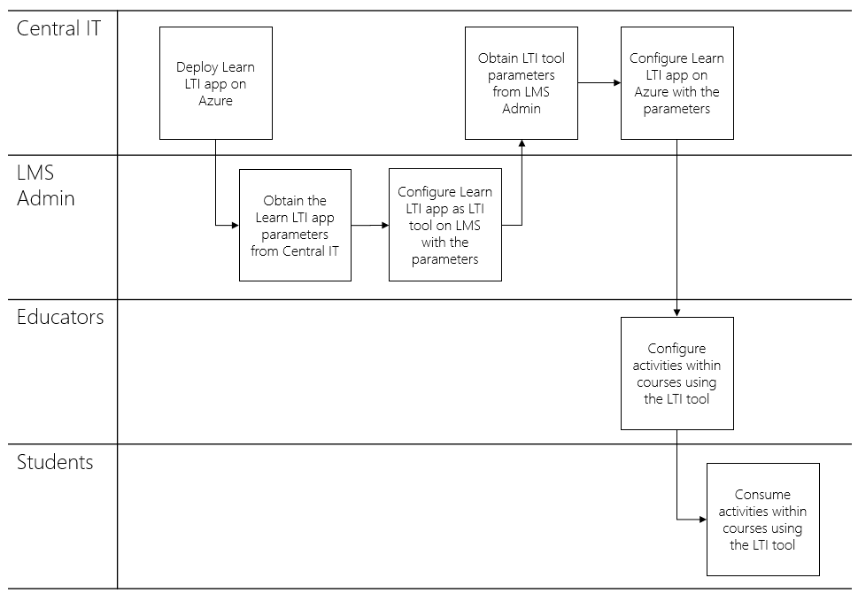

# Microsoft Learn LTI Application 

### About ###
[Microsoft Learn](https://learn.microsoft.com/#/?WT.mc_id=learnlti-github-cxa) is a free, online training platform that provides interactive learning resources for Microsoft products and cutting edge technologies. Our goal is to empower students and educators to learn about technology through fun, guided, hands-on content aimed at specific learning goals. 

To bring Microsoft Learn's content into the classroom, we've made a Learning Tools Interoperability (LTI) application that enables you to seamlessly blend self-paced learning content from the Microsoft Learn catalog with your curriculum and Learning Management System (LMS).

Educators and Institutions can leverage the LTI application to integrate Microsoft Learn Modules and Learning Paths into their curricula while providing hands-on experiences with Azure and other Microsoft technologies. Learners will be routed from their LMS to Microsoft Learn, where they can accrue experience points and achievements as well as track progress on learning activities.

The Microsoft Learn LTI Application adheres to [v1.1](https://www.imsglobal.org/specs/ltiv1p1) and [v1.3](http://www.imsglobal.org/spec/lti/v1p3/) standards. For more specifics on the application itself, check out the [Architecture Overview](./docs/ARCHITECTURE_OVERVIEW.md).

### Key Features: ###
- **Single Sign-On** (SSO) - users only have to sign into their institution once to access the Learn LTI application
- **LMS Pairing** - instructors can create, edit, and publish Learn-based assignments for their courses and populate their insitution's LMS with them easily
- **LTI v1.1 and v1.3 Compliant** - student data is not gathered and their data cannot be accessed; all user data is protected.

### What do I need to get started? ###
Typically, there will be four roles involved in deploying, configuring, and using the Microsoft Learn LTI application with Institution’s LMS.

1. **Central IT / IT Admin** – The user deploying the Microsoft Learn LTI application to Azure. They need to be an owner of an Azure subscription and have the privileges to create Azure resources. This person will also be the one configuring the Microsoft Learn LTI application to work with the LMS.
2. **LMS Admin** – The user configuring the LMS to work with the deployed Microsoft Learn LTI application. Once configured, the Microsoft Learn LTI application will appear as an LTI tool (external tool) to be used by all Educators on the LMS.
3. **Educators** – The user(s) of the LMS who is set up as a “Teacher” in a course and will facilitate the learning. This person will create activities or resources based on the configured LTI tool on the LMS.
4. **Students** – The users of the LMS who will consume the learning provisioned to them by the Educators.

The following visual illustrates the workflow in full:

To deploy the Microsoft Learn LTI application, the Central IT / IT Admin will need:

- LMS System that supports LTI v1.1 or v1.3
- You need to be the **owner** of an Azure subscription
- IT administrator privileges to create an Azure resource

# Table of Contents

1. [Deployment Guide](./docs/DEPLOYMENT_GUIDE.md)
2. [Configuration Guide](./docs/CONFIGURATION_GUIDE.md)
3. [Educator Guide](./docs/USER_GUIDE.md)
4. [Student Guide](./docs/STUDENT_GUIDE.md)
5. [Architecture Overview](./docs/ARCHITECTURE_OVERVIEW.md)
6. [Pricing Structure](./docs/PRICING_STRUCTURE.md)
7. [Take it Further](./docs/TAKE_IT_FURTHER.md)
8. [Frequently Asked Questions](./docs/FAQ.md)
9. [Troubleshooting](./docs/TROUBLESHOOTING.md)

# Contributing

This project welcomes contributions and suggestions.  Most contributions require you to agree to a
Contributor License Agreement (CLA) declaring that you have the right to, and actually do, grant us
the rights to use your contribution. For details, visit https://cla.opensource.microsoft.com.

When you submit a pull request, a CLA bot will automatically determine whether you need to provide
a CLA and decorate the PR appropriately (e.g., status check, comment). Simply follow the instructions
provided by the bot. You will only need to do this once across all repos using our CLA.

This project has adopted the [Microsoft Open Source Code of Conduct](https://opensource.microsoft.com/codeofconduct/?WT.mc_id=learnlti-github-cxa).
For more information, see the [Code of Conduct FAQ](https://opensource.microsoft.com/codeofconduct/faq/?WT.mc_id=learnlti-github-cxa) or
contact [opencode@microsoft.com](mailto:opencode@microsoft.com) with any additional questions or comments.
