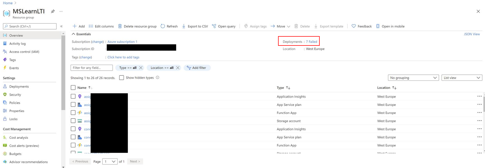
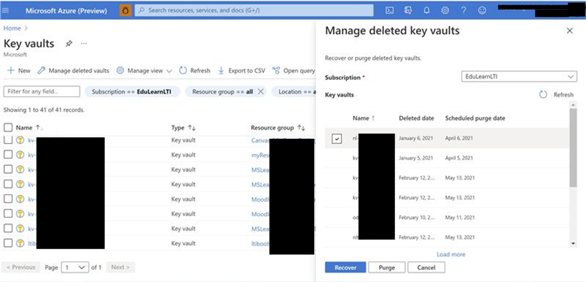

## For issues with the guides and tool

For any and all issues, please raise a [GitHub issue](https://github.com/microsoft/Learn-LTI/issues/new?WT.mc_id=learnlti-github-cxa) so we can help you.

## General Deployment Issues

If your **deployment fails and the resource group has been created**; an IT admin needs to delete the resource group in their subscription and re-run the script again.

If your deployment has an error look [here](https://docs.microsoft.com/azure/azure-resource-manager/templates/common-deployment-errors?WT.mc_id=learnlti-github-cxa) for common errors.

## Check the Failed Deployment status and output

From the Azure Portal, simply select deployments. See the following screenshot.



## Errors deploying install scripts

Insufficient permissions if you try deploying the installation scripts from an account which is not your tenant AAD Admin or Azure Subscription Admin/Owner you will recieve an error

```
ERROR: Directory permission is needed for the current user to register the application. For how to configure, please refer 'https://docs.microsoft.com/azure/azure-resource-manager/resource-group-create-service-principal-portal'. Original error: Insufficient privileges to complete the operation.
Transcript stopped, output file is C:\Users\Learn-LTI\deployment\Log\Transcript-05-01-2020-09-27-47.log
Press any Key to Exit:
```
To debug the error look at the Transcript-date-time.log file and the permissions error will be clearly shown.

The personas/responsibilities for setup are:
- Central IT (Azure tenant Owner, AAD Owner and have permissions to create service principals)
- LMS (Learning Management System Owner who needs to configure the LTI Application)
- Educator (who can provision learn modules into their course)

## Purging Key Vaults

Your Azure Key Vault may be set to soft delete enabled. 

As such if you encounter a issue in the deployment you will have to delete your resource and deploy again you may be presented with this following error.

```
ERROR: Deployment failed. Correlation ID: ************-****-****-**********. {
  "error": {
    "code": "ParentResourceNotFound",
    "message": "Can not perform requested operation on nested resource. Parent resource 'kv-******' not found."
```
Due having soft delete enabled on the Key vault. The Key vault could not be recreated after the install initially fails.
See more details on [Azure Key Vault recovery overview | Microsoft Docs](https://docs.microsoft.com/azure/key-vault/general/key-vault-recovery?tabs=azure-portal)

Key Vault Recovery features are designed to prevent the accidental or malicious deletion of your key vault and secrets, keys, and certificate stored inside key-vault. So under soft delete the key vault is still available for 90 days after deletion therefore you need to purge the deleted Key Valut before it can be recreated.  

### To purge a deleted Key vault

- Go to key vaults-> manage deleted vault 
- Select the kv and select purge

See the following screenshot


## LMS Requirement for Secure Token SSL https 

If you are deploying the service in a test environment please ensure that your test LMS environment had a valid SSL certificate installed we require all traffic to utilise SSL.

## LTI Application Login  error: You are not enrolled in this course

If you receive the following error.


User not registered on the LMS or logged into Web Browser with the incorrect account
- Ensure you are using an Azure AD connected account and logged into their web browser with the same account they used to sign into the LMS. 
- Please ensure that AAD sign for your LMS is enabled and you are signing into your LMS with a AAD account. 
- The emails of the users in the LMS and AAD should match. 
- Ensure the users are active on the course. 

## LTI Application does not load error: {"Message":"Could not validate nonce."}

If you receive a browser message: {"Message":"Could not validate nonce."}

We have seen this is an intermittent issue, it usually happens if the user is trying to replay an old call or if the nonce and state value don't match. If the user simply refreshes the browser the page will load.

## LTI Application does not load error: {"Message":"Could not validate request"}

This issue is typically related to one of the following:
- Check if you have a valid 3rd Party Signed SSL. This services requires a valid 3rd party SSL certificate, self signed SSL certificates are not valid. Please ensure your service is using https:// with a valid SSL certification. 
- Check the Launch URL, please make sure that all the fields are correctly filled while registering the tool and filling tool's platform registration page. See https://github.com/microsoft/Learn-LTI/blob/main/docs/CONFIGURATION_GUIDE.md
- Check the Azure Function/Azure Logs see https://github.com/microsoft/Learn-LTI/blob/main/docs/TROUBLESHOOTING.md#azure-functions-tracing  
## Moodle Users not active - Not Current

All users need to be Active on a course if you see Not Current next to the status.


We have noticed that users having this issue 


We have seen this where students/teacher may of been manually assigned or automatically assigned as showing  "Not Current". 


The solution is simply make the students and teachers active and they can then log in. 
To activate users: Click on the settings wheel in the top right hand corner and select "Enrollment methods" then click the crossed out eye to allow manual enrollment. 

When you go back to the course participants they will show as active and users will be able to load the Learn LTI application.

## Canvas LMS Issuer

If your using on premise, hosted or cloud implementations of Canvas. Ensure you register the parameters back in the Learn LTI application's registration page. Please ensure you always state the  Issuer as https://canvas.instructure.com see the final steps in the Canvas instructions https://github.com/microsoft/Learn-LTI/blob/main/docs/CONFIGURATION_GUIDE.md 

## Missing Name Role Provisioning Service in LTI1.1

NRPS is something that has been a part of LTIAdvantage Specification this service is not available in LTI1.1 
- Moodle implementation as such we recommed you update your moodle environment.
- OpenEdx, There is work happening in the OpenEdX community see the following request and workitems for LTIAdvantage support in OpenEdx
- Is Anyone Working on LTI 1.3? - [Development / Collaborative Proposals](https://discuss.openedx.org/t/is-anyone-working-on-lti-1-3/798/12)
- [TNL-7314] [BD-24] [LTI Advantage & other improvements](https://id.atlassian.com/login?continue=https%3A%2F%2Fopenedx.atlassian.net%2Flogin%3FredirectCount%3D1%26dest-url%3D%252Fbrowse%252FTNL-7314%26application%3Djira&application=jira)
- [BD-24] [LTI v1.3 Improvements: Advantage Support - Open edX Community](https://openedx.atlassian.net/wiki/spaces/COMM/pages/1545076784/BD-24+LTI+v1.3+Improvements+Advantage+Support)

## Error Unauthorized 401 when using Moodle

An Unauthorized (401) Exception occurred when access the Moodle's LTI services.
/mod/lti/services.php/CourseSection/39/bindings/2/memberships
The problem can be related to your Apache Config. 
Solution:
- Edit your httpd.conf file or alternatively in the vhosts file:
- SetEnvIf Authorization "(.*)" HTTP_AUTHORIZATION=$1
- SetEnvIf Content-Type "(.*)" HTTP_CONTENT_TYPE=$1
- SetEnvIf Accept "(.*)" HTTP_ACCEPT=$1 

Reference: https://moodle.org/mod/forum/discuss.php?d=389429

## Step by step guide to connect the SSO experience with AAD.

The details provided at [Planning Active Directory SSO Applications](https://docs.microsoft.com/en-us/azure/active-directory/manage-apps/plan-sso-deployment)

## Steps if your an Office365/Microsoft365 institution but unsure of your Active Directory Details 

Microsoft 365 uses Azure Active Directory (Azure AD) to manage user identities behind the scenes. Your Microsoft 365 subscription includes a free Azure AD subscription so that you can integrate your on-premises Active Directory Domain Services (AD DS) to synchronize user accounts and passwords or set up single sign-on. 

Azure AD also offers other functionality, like managing integrated apps, that you can use to extend and customize your Microsoft 365 subscriptions.

You can use the Azure AD deployment advisors for a guided setup and configuration experience in the Microsoft 365 admin center (you must be signed in to Microsoft 365):

- [Azure AD Connect advisor](https://aka.ms/aadconnectpwsync)
- [AD FS deployment advisor](https://aka.ms/adfsguidance)
- [Azure AD setup guide](https://aka.ms/aadpguidance)

If you have a paid subscription to Microsoft 365, you also have a free Azure AD subscription. You can use Azure AD to create and manage user and group accounts. To activate this subscription, you have to complete a [one-time registration.](https://docs.microsoft.com/en-us/microsoft-365/compliance/use-your-free-azure-ad-subscription-in-office-365?view=o365-worldwide) Afterward, you can access Azure AD from your Microsoft 365 admin center.

Don't go directly to azure.microsoft.com to sign up or you'll end up with a trial or paid subscription to Microsoft Azure that is separate from your free Azure AD subscription with Microsoft 365.

With the free subscription you can synchronize with on-premises directories, set up single sign-on, and synchronize with many software as service applications.

If you want enhanced AD DS functionality, bi-directional synchronization, and other management capabilities, you can upgrade your free subscription to a paid premium subscription. For the details, see [Azure Active Directory editions.](https://azure.microsoft.com/pricing/details/active-directory/)

## Troubleshooting Azure Resource Manager Deployments 

In order to understand the issue in more detail, one way could be to go through the deployment details which could be accessed via Azure Portal.

- Go to Azure Portal
- Choose appropriate Subscription 
- Select Resource Groups blade from Left Rail 
- Choose appropriate Resource Group 
- Select Deployments Blade from Left Rail.
- The log will show which service deployments failed

## Azure Resources Deployments errors 

You could consider trying to re-deploy the same RG/Identity/AppName combination by simply re-executing run.bat or deploy a new RG inside a different region than the one tried previously. Running the same script and resource group names will also create a error if the services and resources are already present for those regions and names.

## Using Hosted services on Cloudfront

We have seen a issue where the "Authorization" header was not being forwarded to the backend by AWS CloudFront. See the following documentation 
[Configure CloudFront to Forward Authorization Headers](https://docs.aws.amazon.com/AmazonCloudFront/latest/DeveloperGuide/add-origin-custom-headers.html#add-origin-custom-headers-forward-authorization?WT.mc_id=edna)

## Debugging Errors related to http500 indicated in Browser with Oops! Something went wrong.. We suggest you go to our help page.

This results in you being unable to open the Assignments page in Learn-LTI. Users access failing with http500 which essentially has been the source of the Oops!something went wrong error message in the browser window.

Please see browser logs if indicate that the membership call being sent to the LMS (Moodle) is returning a 401 Unauthorized and the Learn LTI tool in unable to get the course members from the LMS and hence the it is giving a 500 response. Please make sure that while configuring the tool in Moodle, Under Services, IMS LTI Names and Role Provisioning: `Use this service to retrieve members’ information as per privacy settings.` is selected as mentioned in the [Configuration Guide Learn](CONFIGURATION_GUIDE.md) 

## Azure Functions Tracing 

This should provide details related to the execution context and state of the function execution when it has returned http 204 error.
- Goto your Resource Group inside Azure and select Function App matching users-XXXXXXX.
- Select Functions Blade in Left Hand Pane.
- Select GetUserDetails afterwards.
- Choose Monitor Blade in LHP and you should see the Invocation Traces.
- Clicking on the failing trace should provide more details related to Server logs for that function invocation to help you.

## Failures (Exceptions) in App Insights

- Go to your Resource Group inside Azure and select Application Insights resource matching users-XXXXXXX.
- Select Failures Blade in LHP and then choose Exceptions Tab.
- The subsequent screen should indicate any exceptions that were thrown as a part of function execution and should provide more insights into what might've gone wrong on server when executing GetUserDetails api.
- We'd request you to please share the above details with us in order for us to be able to help you in a better way. Since the details might contain some private information as well. Please feel free to reach out to us via email at learnlti@microsoft.com.

## Failure is in Users Function App

Function app which is not being able to find the user (signed-in via AAD) enrolled into the current course. 

Please check that the return code for the API in the Chrome DevTools network tab is http204 (i.e. No-Content).

In our experience, the only case when this happens is when user signs into Learn-LTI app with an onmicrosoft.com account which does not map to the email of any of the enrolled users of the course.

## Raising a Issue

If you are still having trouble, please raise a [GitHub issue](https://github.com/microsoft/Learn-LTI/issues/new?WT.mc_id=learnlti-github-cxa).
